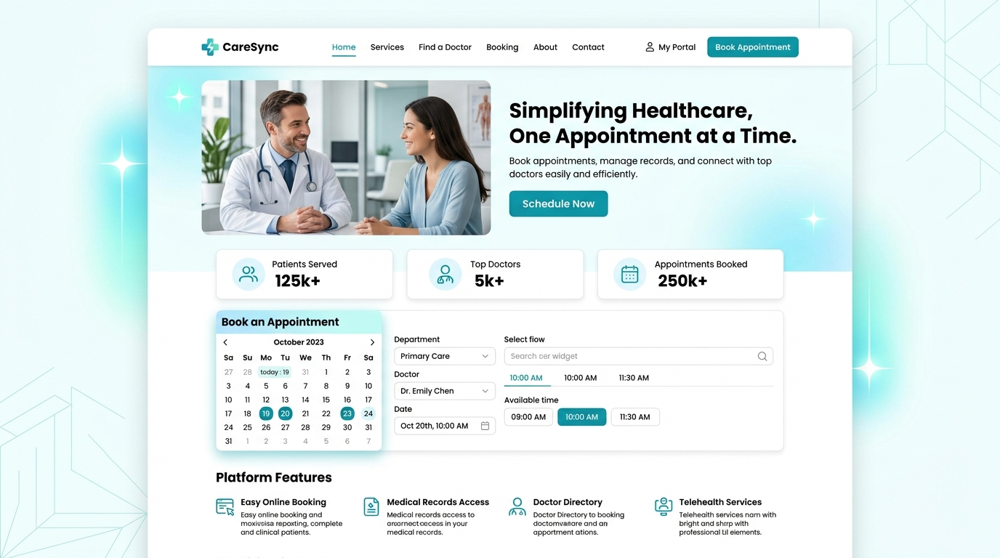
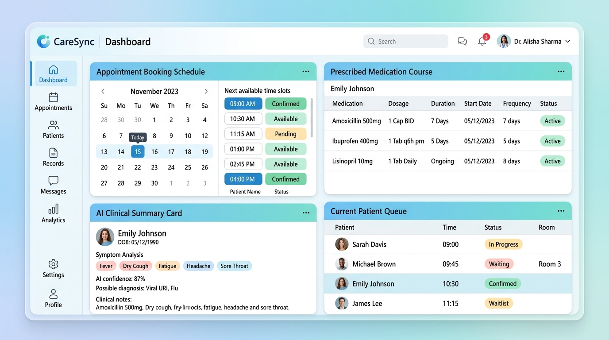

# CareSync: Healthcare Appointment & Clinical Management Platform

[](https://caresync-healthcare.onrender.com)
[](https://fastapi.tiangolo.com)
[](https://www.python.org)
[](https://aistudio.google.com)
[](https://opensource.org/licenses/MIT)

> **Live Production Website**: 🌐 **[https://caresync-healthcare.onrender.com](https://caresync-healthcare.onrender.com)**  
> **Interactive Swagger API Documentation**: 📖 **[https://caresync-healthcare.onrender.com/docs](https://caresync-healthcare.onrender.com/docs)**

---

## 📸 Platform Screenshots

### 1. Modern Patient Landing Page & Smart Slot Discovery


### 2. Clinical Workspace, Patient Schedule & AI Diagnosis Summary


---

## 🔑 Quick 1-Click Demo Accounts

The platform comes pre-seeded with instant demo credentials for immediate evaluation:

| Role | Email | Password | Key Capabilities |
| :--- | :--- | :--- | :--- |
| **🛡️ Hospital Admin** | `admin@hospital.org` | `AdminPass123!` | Onboard physicians, configure shift schedules, manage doctor leaves, and view system metrics. |
| **🩺 Attending Doctor** | `doctor@hospital.org` | `DoctorPass123!` | Review consultation queues, view AI clinical triage summaries, and prescribe medication courses. |
| **👤 Demo Patient** | `patient@example.com` | `Password123!` | Real-time smart slot booking, atomic 10-min slot holds, Google Calendar sync, and email alerts. |

---

## 🌟 Key Features

### 👤 Patient Portal
- **Smart Appointment Booking**: Dynamic slot discovery calculated from weekly shift hours, doctor leaves, and existing bookings.
- **Atomic Slot Holds**: 10-minute temporary slot reservation to eliminate race conditions and double-booking.
- **Rescheduling & Cancellations**: Immediate slot release, audit trail logging, and calendar sync updates.
- **Medication Reminders**: Track prescribed medications with dosage, frequency, and background reminder alerts.
- **Google Calendar Sync**: Real-time two-way synchronization of confirmed appointments to Google Calendar via OAuth 2.0.

### 🩺 Doctor Clinical Workspace
- **Daily Agenda & Schedule**: Filter today's consultations, upcoming queues, and completed patient cases.
- **AI Clinical Summaries**: Instant structured pre-consultation symptom summaries powered by **Google Gemini AI** with heuristic fallbacks.
- **Consultations & Prescriptions**: Record diagnoses, clinical notes, and structured medication courses (dosage, frequency, instructions).

### 🛡️ Admin Operations Panel
- **Medical Staff Directory**: Onboard physicians, configure consultation slot durations, and manage account statuses.
- **Shift & Leave Management**: Configure weekly shift hours and schedule doctor leaves with automatic conflict resolution.
- **System Metrics & Delivery Monitor**: Real-time tracking of users, appointments, leave conflicts, and email notification health.

---

## 🏗️ System Architecture

```
CareSync/
├── backend/
│   ├── app/
│   │   ├── main.py              # FastAPI application entry point & static mounting
│   │   ├── config.py            # Environment configurations
│   │   ├── database.py          # SQLAlchemy engine, session lifecycle & auto-seeding
│   │   ├── models/              # Relational database models
│   │   ├── schemas/             # Pydantic request/response schemas
│   │   ├── routes/              # Modular REST API endpoints
│   │   ├── services/            # Core business logic & ACID transactions
│   │   ├── tasks/               # Celery background workers & schedules
│   │   └── utils/               # Security, hashing, & OAuth dependencies
│   ├── alembic/                 # Database migrations
│   ├── requirements.txt         # Python dependencies
│   └── .env.example             # Environment template
├── frontend/
│   ├── index.html               # Landing page
│   ├── login.html               # Authentication & 1-click role switcher
│   ├── register.html            # Patient registration
│   ├── patient/                 # Patient portal (Dashboard, Booking, Profile)
│   ├── doctor/                  # Doctor portal (Agenda, Case Review, Notes)
│   ├── admin/                   # Admin portal (Staff Directory, Leaves, Monitor)
│   ├── css/styles.css           # Design system, glassmorphism, & skeletons
│   └── js/                      # API client, Auth state, & UI helpers
├── docs/                        # Complete technical documentation
│   ├── screenshots/             # High-resolution platform UI preview images
│   ├── system-design.md         # Architecture, ACID transactions & concurrency
│   ├── api-documentation.md     # OpenAPI REST endpoints & schemas
│   ├── database-schema.md       # Relational tables, keys, & indexes
│   ├── llm-prompts.md           # Gemini AI prompts & clinical safety
│   └── google-calendar-setup.md # Google OAuth 2.0 & Calendar sync guide
└── tests/                       # Automated end-to-end test suites
```

---

## 🚀 Local Development Setup

### 1. Prerequisites
- **Python**: 3.10+
- **Redis Server** *(Optional for Celery workers)*: 6.0+

### 2. Backend Installation & Startup
```bash
# 1. Clone repository
git clone https://github.com/jiyasingh5725/Healthcare-Appointment-Manager.git
cd Healthcare-Appointment-Manager

# 2. Create and activate virtual environment
python -m venv venv
# Windows:
venv\Scripts\activate
# Linux/macOS:
source venv/bin/activate

# 3. Install dependencies
pip install -r backend/requirements.txt

# 4. Configure environment
cp backend/.env.example backend/.env

# 5. Start unified FastAPI & Frontend Server
python -m uvicorn app.main:app --app-dir backend --host 127.0.0.1 --port 8000 --reload
```

- **Website**: `http://127.0.0.1:8000`
- **Interactive Swagger Docs**: `http://127.0.0.1:8000/docs`
- **Health Check**: `http://127.0.0.1:8000/api/health`

---

## 🧪 Running Automated Test Suites

```bash
# Phase 16: Email & Multichannel Notification Delivery
python tests/test_phase16_email_notifications.py

# Phase 17: Background Reminders & Celery Beat Automation
python tests/test_phase17_background_reminders.py

# Phase 18: Google Calendar OAuth 2.0 & Synchronization
python tests/test_phase18_google_calendar.py

# Phase 19: Complete Reschedule & Cancellation Synchronization
python tests/test_phase19_appointment_synchronization.py
```

---

## 📚 Technical Documentation

- [System Design Document](docs/system-design.md): Concurrency control, double-booking prevention, locking, ACID transactions, and doctor leave resolution.
- [REST API Specification](docs/api-documentation.md): Comprehensive endpoint specifications with parameters, request payloads, and response models.
- [Database Schema](docs/database-schema.md): Complete data dictionary covering all relational tables, foreign keys, and indexes.
- [LLM Prompts & AI Clinical Integration](docs/llm-prompts.md): Gemini AI prompt templates, JSON schema validation, and fallback heuristics.
- [Google Calendar Setup Guide](docs/google-calendar-setup.md): Step-by-step setup for Google Cloud Console OAuth 2.0 credentials and background sync.
- [Production Deployment Guide](docs/deployment.md): Detailed deployment instructions for cloud servers and containerized setups.

---

## 📄 License
CareSync is distributed under the MIT License.